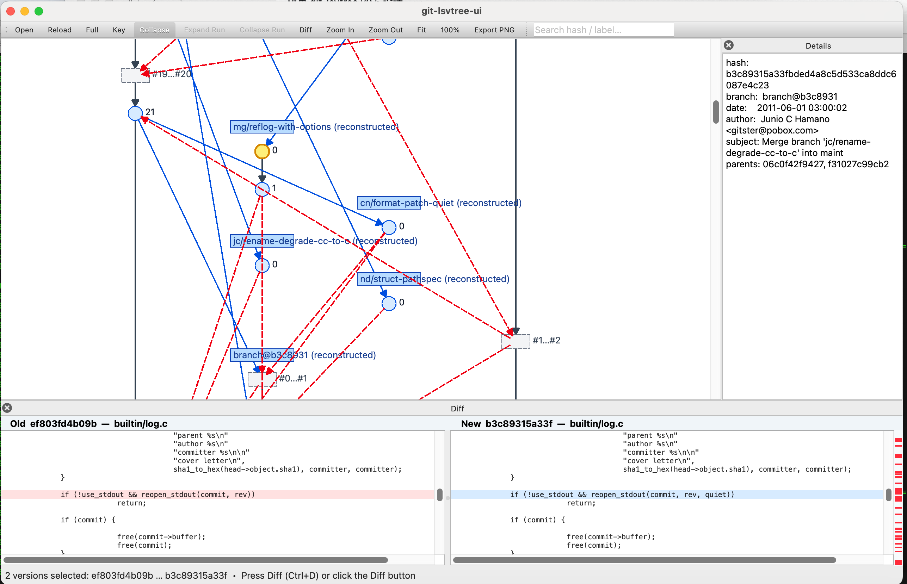

# git-lsvtree-ui

Interactive single-file version tree browser for Git, inspired by ClearCase's `lsvtree` command. Visualizes the full branch/merge history of a single tracked file as a graphical tree.

  

---

## Screenshot



---

## Features

- **Dynamic branch layout** — branches are placed next to their fork point (interval packing), so fork and merge lines stay short regardless of how many branches exist
- **Branch tree view** — ClearCase-style column layout; one column per concurrent branch, shared by non-overlapping branches
- **Key / Full mode** — automatically samples key nodes (branch tips, merge points, tags) when history is large; switch to Full for all commits
- **Collapse runs** — linear chains of intermediate commits are folded into a single dashed rectangle; double-click to expand
- **Side-by-side diff** — click one node, Ctrl+click a second, then press Diff (Ctrl+D); the bottom panel shows old (red) and new (blue) content side-by-side with synchronized scrolling and an overview ruler
- **Tag display** — version nodes that carry Git tags show the tag name in amber below the version number
- **Detail panel** — click any node to see hash, author, date, subject, tags, and parent commits
- **Search** — type a hash prefix or label in the toolbar search box to highlight and scroll to a node
- **Export PNG** — File → Export PNG to save the current graph as an image
- **Level-of-detail** — labels are hidden automatically when zoom drops below 35%
- **Background loading** — git history is loaded in a worker thread; the UI stays responsive

---

## Architecture

```
git_lsvtree_ui/
├── core/                   # Pure Python, no Qt dependency
│   ├── git_repo.py         # Git subprocess wrapper (GitRepo, GitCommandError)
│   ├── history_loader.py   # Parses `git log --follow --all` into GraphModel
│   ├── branch_rebuilder.py # Reconstructs branch names from topology
│   ├── key_selector.py     # Selects skeleton + tag + sampled nodes for Key mode
│   ├── collapse_model.py   # Folds linear chains → DisplayGraph with run nodes
│   ├── diff_service.py     # Fetches full file content at each version → DiffResult
│   └── graph_model.py      # Frozen dataclasses: VersionNode, GraphModel, DisplayNode, DisplayGraph
│
├── layout/                 # Coordinate computation, no Qt dependency
│   ├── geometry.py         # Point, Rect value types
│   └── tree_layout.py      # Maps DisplayGraph → LayoutGraph (pixel coordinates)
│                           # Branch interval packing: cols shared by non-overlapping branches
│
├── ui/                     # Qt widgets
│   ├── items.py            # QGraphicsItem subclasses: VersionNodeItem, CollapsedRunItem, EdgeItem, BranchHeaderItem
│   ├── graph_scene.py      # QGraphicsScene: hit-testing, selection, LOD, highlight
│   ├── graph_view.py       # QGraphicsView: Ctrl+wheel zoom, middle-button pan, wheel scroll
│   ├── detail_panel.py     # QTextEdit: shows commit metadata on node click
│   ├── diff_panel.py       # Side-by-side diff with scroll sync and overview ruler
│   └── status_bar.py       # QStatusBar: file info, mode, zoom, warnings
│
├── app/                    # Application layer
│   ├── graph_loader.py     # QRunnable workers: GraphLoaderWorker, DiffLoaderWorker
│   ├── main_window.py      # QMainWindow: wires all components, manages state
│   └── __main__.py         # Entry point
│
├── tests/                  # Pytest regression suite (79 cases, no display required)
└── doc/                    # Design document and screenshots
```

### Data flow

```
File path
  └─► GitRepo.from_file()
        └─► HistoryLoader.load()            →  GraphModel  (raw commits + edges)
              └─► BranchRebuilder.rebuild()  →  GraphModel  (branch labels assigned)
                    └─► KeySelector.select()  →  GraphModel  (pruned to threshold)
                          └─► CollapseModel.build()  →  DisplayGraph  (runs collapsed)
                                └─► TreeLayout.layout()  →  LayoutGraph  (pixel coords)
                                      └─► GraphScene.set_layout_graph()  →  Qt items on screen
```

All git I/O runs in `QThreadPool` workers; the main thread only receives finished `GraphLoadResult` / `DiffResult` via Qt signals.

---

## Requirements

| Package | Version | Purpose |
|---------|---------|---------|
| Python  | ≥ 3.11  | `match`, `tomllib`, PEP 695 type hints |
| PySide6 | ≥ 6.6   | Qt6 bindings (QGraphicsView, QRunnable, signals) |
| git     | ≥ 2.23  | `--follow`, `--format`, `log --all` options used |

Install dependencies:

```bash
pip install PySide6
```

Or install the package itself in editable mode:

```bash
pip install -e .
```

---

## Usage

```bash
# Open the UI with an empty window (use Ctrl+O to pick a file)
python -m git_lsvtree_ui

# Open directly on a file
python -m git_lsvtree_ui path/to/some/tracked_file.py
```

### Keyboard shortcuts

| Shortcut | Action |
|----------|--------|
| Ctrl+O   | Open file |
| F5       | Reload |
| Ctrl+D   | Diff selected versions |
| Ctrl+E   | Export PNG |
| Ctrl++   | Zoom in |
| Ctrl+-   | Zoom out |
| Ctrl+0   | Fit to window |
| Ctrl+1   | Reset zoom to 100% |

### Selecting versions for diff

1. **Click** any circular version node → node turns yellow, Details panel shows commit info
2. **Ctrl+click** a second version node → both highlighted
3. Press **Diff** in the toolbar or **Ctrl+D** → bottom panel shows side-by-side diff

> Collapsed run rectangles (dashed border) cannot be diffed directly.  
> Double-click a run to expand it, then select individual version nodes.

### Navigation

- **Scroll wheel** — scroll the version tree up/down
- **Ctrl + Scroll wheel** — zoom in/out (labels auto-hide below 35% zoom)
- **Middle mouse button drag** — pan the canvas freely
- **Search box** (toolbar) — type a hash prefix or version label to jump to a node

---

## Running tests

```bash
pip install pytest
pytest tests/ -v
```

The test suite (79 cases) covers all core and layout layers without requiring a display.

---

## Quick test with a real repository

```bash
# Clone any repo and open a file with rich history
git clone https://github.com/pallets/flask.git /tmp/flask
python -m git_lsvtree_ui /tmp/flask/src/flask/app.py
```
